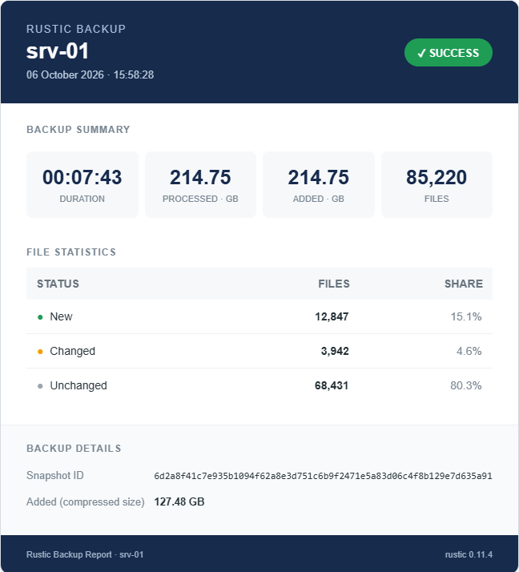
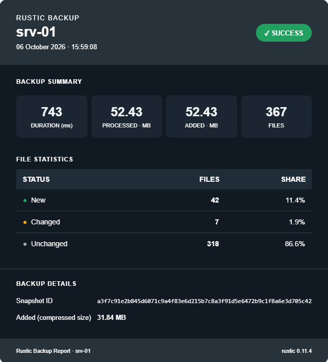
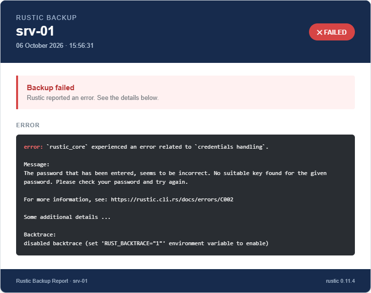
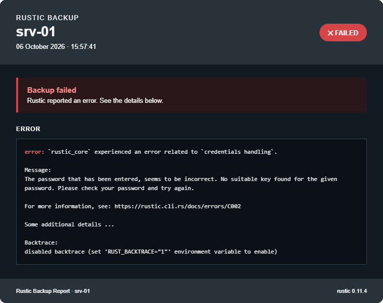

# rustic-backup-report

You use [rustic-rs/rustic](https://github.com/rustic-rs/rustic) for your backups and would like a cool looking backup report?
Then this is for you!

## Features

- Creates an HTML report from the log-output of your rustic backup
- Reports for success and failure, each with a light and a dark template included in this repository
- Optionally sends the created report by mail via SMTP

### Success-Report

Displays the values of the backup run.

- A backup duration below 1 second is displayed in ms
- Data sizes below 1 GB are displayed in MB

| Light | Dark |
|---|---|
|  |  |

### Failure-Report

Displays the error message of rustic.

| Light | Dark |
|---|---|
|  |  |

## Requirements

- Python >= 3.14.4
- [rustic](https://github.com/rustic-rs/rustic) >= 0.11.4

## Get started

1. Clone the repository

   ```bash
   git clone https://github.com/airfryer-nugget/rustic-backup-report
   cd rustic-backup-report
   ```

2. Enable the JSON progress output in your rustic config

   ```toml
   [global]
   json-progress = true
   ```

   or use the CLI parameter `--json-progress`.

3. Capture the output of your rustic backup command in log files

   ```bash
   rustic backup > /path/to/rustic-output.jsonl 2> /path/to/rustic-error.log
   ```

   stdout is written to `rustic-output.jsonl` (JSONL), stderr to `rustic-error.log`. Both files are overwritten on every run.

4. Rename `rustic_report.conf.example` to `rustic_report.conf` and adjust the settings, see [Settings explanation](#settings-explanation)

   ```bash
   mv rustic_report.conf.example rustic_report.conf
   ```

5. Call the script using the hooks of rustic

   ```toml
   [backup.hooks]
   run-after = ["python3 /path/to/rustic_report/rustic_report.py --status success"]

   [global.hooks]
   run-failed = ["python3 /path/to/rustic_report/rustic_report.py --status failure"]
   ```

   Command line options of `rustic_report.py`:

   | Option | Description | Default |
   |---|---|---|
   | `--status` | Report type, `success` or `failure`. Selects the template and the mail subject | `success` |
   | `--config` | Path to the config file | `rustic_report.conf` next to the script |

## Settings explanation

Relative paths in the config file are resolved relative to the directory of the config file.

### [report]

| Setting | Default | Description |
|---|---|---|
| `jsonl_file` | required | Path to the JSONL output of `rustic backup` (stdout) |
| `error_log_file` | required for failure reports | Path to the error output of `rustic backup` (stderr) |
| `template-success` | required for success reports | Path to the HTML template for success reports |
| `template-failure` | required for failure reports | Path to the HTML template for failure reports |
| `output` | required | Path of the generated HTML report |
| `log_file` | `./log/rustic_report.log` | Log file of `rustic_report.py` |
| `hostname` | `auto` | Hostname shown in the report. `auto` uses the hostname of the system |
| `rustic_version` | `auto` | Version shown in the report. `auto` uses the output of `rustic --version` |

### [mail]

| Setting | Default | Description |
|---|---|---|
| `sendmail` | `false` | If `true`, the generated report is sent by email after creation using the settings in your `rustic_report.conf`. The built-in mail sender is intentionally simple and provided as a basic convenience option. Set to `false` to disable it and use your own mail delivery mechanism (recommended for production deployments).|
| `smtp_server` | required | Address of the SMTP server |
| `smtp_port` | `587` | Port of the SMTP server |
| `smtp_security` | `starttls` | `starttls` or `ssl` |
| `smtp_auth` | `false` | `true` if the SMTP server requires authentication |
| `smtp_user` | - | User name, only used if `smtp_auth = true` |
| `smtp_password` | - | Password, only used if `smtp_auth = true` (when using this setting, you should use chmod 600 for the .conf-file ) |
| `smtp_password_file` | - | File containing the password, only used if `smtp_auth = true` (recommended over smtp_password) |
| `sender` | required | Sender address |
| `recipients` | required | Recipient addresses, separated by comma |
| `subject-success` | `Rustic Backup Report` | Mail subject of success reports |
| `subject-failure` | `Rustic Backup Report` | Mail subject of failure reports |
| `log_file` | empty | Log file of `send_report_mail.py`. If empty, errors are written to stderr. May contain recipient addresses on errors.|


## Custom templates

You can create your own HTML template and use it by setting `template-success` and `template-failure` in the config file.

Placeholders are inserted with `{{ name }}`. Values are HTML-escaped. If a value is not available, it is replaced with `-`.

The "Rustic field" column shows the name of the field in the "summary" of the JSONL file (rustic-log) from which the values are read.

### Success

| Placeholder | Rustic field | Description |
|---|---|---|
| `hostname` | - | Hostname from the config or the system |
| `report_date` | - | Date and time the report was created |
| `status` | - | `success` or `failure` |
| `status_label` | - | `SUCCESS` or `FAILED` |
| `rustic_version` | - | Output of `rustic --version` or the value from the config |
| `duration` | `total_duration` | Duration as `HH:MM:SS`, or in ms if below 1 second |
| `duration_label` | - | `DURATION`, or `DURATION (ms)` if below 1 second |
| `data_processed` | `total_bytes_processed` | Processed data as number |
| `data_processed_unit` | - | `MB` or `GB` |
| `data_added` | `data_added` | Added data as number |
| `data_added_unit` | - | `MB` or `GB` |
| `data_added_repository` | `data_added_packed` | Added data in the repository (compressed size), including unit |
| `files_total` | `total_files_processed` | Total number of files. If missing, the sum of new, changed and unchanged files |
| `files_new` | `files_new` | Number of new files |
| `files_new_percent` | - | Share of new files in `files_total` |
| `files_changed` | `files_changed` | Number of changed files |
| `files_changed_percent` | - | Share of changed files in `files_total` |
| `files_unmodified` | `files_unmodified` | Number of unchanged files |
| `files_unmodified_percent` | - | Share of unchanged files in `files_total` |
| `snapshot_id` | `snapshot_id` | ID of the created snapshot |

### Failure

| Placeholder | Source | Description |
|---|---|---|
| `error_message` | `error_log_file` | Error output as plain text, without colors. HTML-escaped |
| `error_message_html` | `error_log_file` | Error output with the colors of rustic converted to HTML `<span>` elements. Inserted unescaped, use it inside a `<pre>` element |

Lines starting with `[INFO]` are removed and only the last 30 lines are used.

The placeholders `hostname`, `report_date`, `status`, `status_label` and `rustic_version` are available as well. The success values are usually `-` in a failure report, because there is no summary-log if the backup fails.

## License

This project is licensed under the GNU General Public License v3.0.
See the [LICENSE](LICENSE) file for details.

## Development notes

This is my first project published on GitHub.

This project was developed with substantial assistance from AI-based development tools, which were used throughout the development process for code generation, refactoring, debugging, and documentation.

The project was tested to verify that the implemented functionality works as intended. Errors and issues identified during development were addressed and resolved where applicable.

Feedback, suggestions, and improvements are very welcome.
